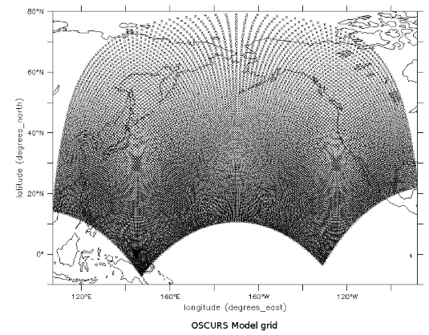

# OSCURS Model

## Data Workflow
1. FNMOC sftp’s 360° x 180° SLP to the server oceanwatch every 6-hours
- Fleet Numerical Meteorology and Oceanography Center (FNMOC, near the airport in Monterey) runs numerical models to generate forecasts of 6-hourly mean sea level pressure and other parameters. (GRIB format)
 - These forecasts are used for the Navy fleet but are generally not stored by FNMOC. ERD (PEG, PFEG, PFEL) has gathered, stored, and used this 6-hour model output for decades to generate Bakun Upwelling Index
2. Cron job on oceanwatch converts the data from GRIB to NetCDF
- daily: around 7am a file is generated containing current month’s data: **monthly_pressure.nc** (this file potentially/occasionally has missing data)
- monthly: a process runs to add the month’s data to a yearly NetCDF file, calculate Ekman transports and upwelling index. Any missing data is captured in this process. These files, are served on ERDDAP
3. Cron job (daily) on oceanwatch calculates 6-hr upwelling index and transports, displayed on web page, and transferred to oceanview
4. On oceanview (7:45 am) for OSCURS, **daily FNMOC 6-hr mean sea level pressure (1-degree resolution, 180 x 360) is linearly interpolated to an equal-area 180 x 92 grid** (0000 pressure each day) saved to **this_month_oscurs.nc**, appended to **oscurs_pressure.nc**
 - OSCURS grid:
   - 
 - input:
   - [on ERDDAP](https://coastwatch.pfeg.noaa.gov/erddap/griddap/erdlasFnTransMon.graph?P_msl%5B(202507-09T06:00:00Z)%5D%5B(-90.0):(90.0)%5D%5B(0.0):(359.0)%5D,v%5B(2025-07-09T06:00:00Z)%5D%5B(-90.0):(90.0)%5D%5B(0.0):(359.0)%5D&.draw=surface&.color=0x000000&.bgColor=0xffccccff)
   - [on THREDDS](https://oceanview.pfeg.noaa.gov/thredds/dodsC/Model/FNMOC/current_month/this_month_transport.nc.html)
- Interpolated output (input to the model):
  - [on ERDDAP](https://coastwatch.pfeg.noaa.gov/erddap/griddap/erdlasFnOscurs.html)
  - [on THREDDS](https://oceanview.pfeg.noaa.gov/thredds/dodsC/oscurs_model/oscurs_pressure.nc.html)
- File **oscurs_pressure.nc** contains all data prior to current month. The daily pressure is appended  to this file, but a backup is maintained so that at the end of the month, the corrected monthly file can be appended. This file has gotten way too large. It would be much better if the file was broken down into yearly files (or even decade files).
- daily fortran code: folder **daily_netcdf_generation**
  - pres_interp_daily.f
  - pres_append_daily.f
- monthly fortran code: **monthly_netcdf_generation**
  - pres_interp_monthly.f
  - pres_append.f
- Ryan’s attempt at converting fortran interpolation to python: **Ryan_netcdf_generation**
	(this code got close, but wasn’t quite right somehow)

## OSCURS Model Workflow
1. The interpolated data from above is used as the input to the OSCURS model
2. OSCURS code is in folder **model_code**, and all the parameter input is contained web page folder **oscurs_web_page**

## OSCURS Web Page
1. The web page code is in folder **oscurs_web_page**
2. Written using [Dojo toolkit](https://dojotoolkit.org/) (running on current version, but actual code developed on a much earlier version)
3. php is used to execute the command to run the OSCURS model given input parameters input by user on web page
4. This following is an unadvertised feature, since it could potentially fill up a directory on the server, but it illustrated how the model is run from the web page. Certain users also run it this way as a batch job. The code can from a script using something like wget.  Here's an example from the Unix command line:
   wget -O test.txt "https://oceanview.pfeg.noaa.gov/oscurs/runOscurs9.php?cl=1&latdeg=45&latmin=0&londeg=175&lonmin=0&year=2011&mon=NOV&day=4&nnnn=20&factor=1&angle=0&ddfac=1&outfile=filename1.csv"

This will give you a 20 day track starting at 45N, 175W, Nov 4 2011, where the output will be written to the file on your computer called test.txt in your current directory.

OSCURS is written in very old FORTRAN code, and is quite picky about the input:

cl - always 1 (has to do with where oscurs is getting input)

latdeg - degree portion of latitude

latmin - minutes portion of latitude (0-60 minutes)

londeg - degree portion of longitude (degrees WEST)

lonmin - minutes portion of longitude (0-60 minutes WEST)

year - 4 digit year

mon - three letter month - capitalized!!

'JAN','FEB','MAR','APR','MAY','JUN','JUL','AUG','SEP','OCT','NOV','DEC'

day - calendar day of month

nnnn - number of days for the run

factor -wind current speed coefficient

angle - wind angle deviation

ddfac - geostrophic current factor

for definitions of the last three parameters, see
https://oceanview.pfeg.noaa.gov/oscurs/
and click on 'optional parameters' in the left menu

outfile - a unique file name.  OSCURS writes an output file to the server for every run.  The file must not already exist.  I use a combination of random numbers, dates, and run parameters to ensure this.  If you are not getting an output track, the output file probably already exists.  I've just cleared out the directory of output files, so as long as you come up with a scheme that uses a different file for each run you should be ok (numbered sequentially, or whatever).

Note that even though the input longitude is in degrees WEST, the output is in degrees EAST.
